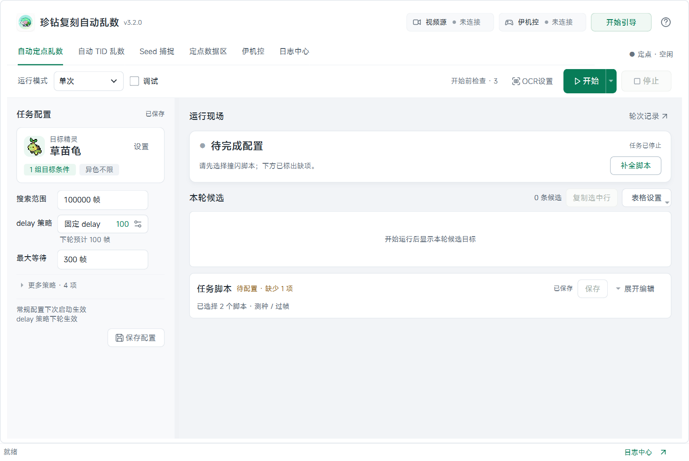

<p align="center">
  
</p>

<h1 align="center">珍钻复刻自动乱数</h1>

<p align="center">
  从眨眼测种到自动撞闪，在一个工作区完成 BDSP 乱数。
</p>

<p align="center">
  <a href="https://github.com/XiaoyuBook/auto-bdsp-rng/releases/latest"></a>
  
  <a href="LICENSE.txt"></a>
</p>

<p align="center">
  <a href="https://github.com/XiaoyuBook/auto-bdsp-rng/releases/latest"><strong>下载 Windows 版</strong></a> ·
  <a href="#快速开始">快速开始</a> ·
  <a href="docs/USAGE.md">使用指南</a> ·
  <a href="CHANGELOG.md">更新日志</a> ·
  <a href="https://github.com/XiaoyuBook/auto-bdsp-rng/issues">问题反馈</a>
</p>

`auto-bdsp-rng` 是面向《宝可梦 晶灿钻石 / 明亮珍珠》（BDSP）的免费开源 Windows 桌面工具。它将眨眼测种、目标搜索、伊机控脚本、OCR 判闪和结果反查整合到同一个界面，支持自动定点与自动 TID 两种流程。



<p align="center"><sub>v3.3.0 源码的实际界面，展示未连接设备时的初始状态。</sub></p>

## 主要功能

| 功能 | 可以做什么 |
| --- | --- |
| **自动定点乱数** | 串联测种、搜索、过帧、校正、撞闪、OCR 判闪与反查，支持多目标、单次及循环运行。 |
| **自动 TID 乱数** | 搜索多个 Display TID，查看预计到达时间和取名倒计时，自动触发取名脚本。 |
| **Seed 捕捉与定点搜索** | 基于 Project_Xs 眨眼恢复 Seed，按 PokeFinder 口径生成、筛选定点与游走候选。 |
| **脚本与键盘控制** | 编辑、运行和录制 EasyCon 风格脚本，用键盘控制主机并自定义按键映射。 |
| **OCR 与 delay 策略** | 识别性格、个性和能力值；按精灵保存反查样本，选择固定或动态 delay 策略。 |
| **轮次记录与日志** | 查看每轮候选、运行结果和实际 delay，按来源与关键词筛选日志、复制或导出记录。 |
| **QQ 通知** | 通过 QQ 开放平台机器人接收任务完成、异常和运行截图；支持私聊、群聊、图文测试与软件内绑定教程。 |

## 下载与安装

**[下载最新 Windows x64 绿色版](https://github.com/XiaoyuBook/auto-bdsp-rng/releases/latest)**

当前正式版为 **[v3.3.0](https://github.com/XiaoyuBook/auto-bdsp-rng/releases/tag/v3.3.0)**。

1. 在 Release 页的 **Assets** 中下载 `auto-bdsp-rng-v3.3.0-windows-x64.zip`。
2. 完整解压，进入 `auto-bdsp-rng` 文件夹。
3. 双击 **`珍钻复刻自动乱数.exe`** 启动。

绿色版已包含 Python 运行环境、OCR 模型和伊机控运行时，无需另装 Python、EasyCon 或 EasyConBridge。请保留 exe 旁的 `_internal`、`script`、`docs` 等目录。

> `Source code (zip)` / `Source code (tar.gz)` 是源码包，不能直接双击运行；`.update.zip` 是供应用升级器使用的增量包。首次使用请下载上面的完整绿色版。

**已有旧版？** 在软件中选择「帮助 → 检查更新…」。v3.0.0 及之后的版本支持增量升级；v2.1.7 及更早版本，或提示没有升级链时，请下载完整包。[查看更新与文件保留规则 →](docs/USAGE.md#自动更新)

待发布的 v3.3.1 支持 Gitee 更新源：优先从国内源检查和下载更新，失败时回退 GitHub，并保持相同的 SHA-256 校验。旧版本需要先通过 GitHub 更新或手动安装完整包，才能使用国内源。

## 快速开始

### 准备设备

| 项目 | 要求 |
| --- | --- |
| 电脑 | Windows x64。 |
| 主机与游戏 | 可向采集卡输出画面的 Nintendo Switch，以及《晶灿钻石》或《明亮珍珠》。 |
| 视频输入 | 可正常获取游戏画面的采集卡，默认按 1920×1080、MJPG、30 fps 请求采集。 |
| 控制设备 | 可用的伊机控串口设备及对应驱动，用于脚本和键盘控制。 |

### 完成第一轮

1. **连接画面** — 点击顶部「视频源」入口，选择采集卡并连接，优先使用「Media Foundation（推荐）」。
2. **验证控制** — 点击顶部「伊机控」连接串口，用键盘控制或短脚本确认主机能收到按键。
3. **完成测种** — 在「Seed 捕捉」页先框选眼睛 ROI，再截取眼睛模板并保存，验证一次 Seed 捕捉。
4. **核对识别与脚本** — 在 OCR 设置中执行「测试全部」，核对性格、个性和六项能力值；判闪计时区域单独测试。按游戏站位逐份验证所选脚本。
5. **运行一次** — 在「自动定点乱数」中设置目标、筛选条件、脚本和基准 delay，完成开始前检查，选择「单次」后点击「开始」。

脚本和 delay 需要结合设备响应、游戏站位与队伍配置校准。建议先确认单次流程能够正常完成，再开启循环。自动 TID 的准备步骤见[自动 TID 使用说明](docs/USAGE.md#自动-tid-乱数)。

> **v3.3.0 新增：QQ 通知与软件内绑定教程**
>
> 当前源码已加入 QQ 开放平台机器人通知。先打开 [QQ 开放平台机器人管理](https://q.qq.com/#/apps)，再在软件教程内填写 AppID、AppSecret，绑定私聊或群聊，等待动态更新的 60 秒绑定码，并发送带软件 Logo 的图文测试；自动乱数任务完成或异常时可接收通知。此功能已随 v3.3.0 发布。[了解 QQ 通知 →](docs/QQ_BOT_SETUP.md)

v3.2.0 的首次乱数引导、脚本执行跟随和暂停修改等功能已包含在当前正式版中。[了解首次乱数引导 →](docs/USAGE.md#首次乱数引导)

## 文档

| 想了解什么 | 从这里开始 |
| --- | --- |
| 视频源、眼睛框选、测种与校正 | [使用指南](docs/USAGE.md#视频源与预览) |
| 自动定点、delay、OCR 与反查 | [自动定点乱数](docs/USAGE.md#自动定点乱数) · [OCR](docs/USAGE.md#ocr) |
| 脚本、录制与虚拟手柄快捷键 | [伊机控与脚本](docs/USAGE.md#伊机控与脚本) |
| 轮次结果、错误与运行日志 | [日志中心](docs/USAGE.md#日志中心) |
| 源码环境、CLI 与测试 | [开发指南](docs/DEVELOPMENT.md) |
| QQ 通知（顶部「通知」入口，含软件内注册与绑定教程） | [配置与使用](docs/QQ_BOT_SETUP.md) · [独立测试工具](tools/qq_notify_test/README.md) |
| Windows 打包与发布 | [构建说明](BUILD.md) · [发布流程](RELEASE.md) |
| 各版本的改动 | [更新日志](CHANGELOG.md) |

## 常见问题

<details>
<summary><strong>视频源连接失败或没有画面怎么办？</strong></summary>

先确认设备接线，并关闭其他占用同一采集卡的程序；在「视频源设置」中重新连接。Media Foundation 不兼容时可尝试 DirectShow。若仍失败，到「日志中心」查看采集参数和超时阶段。使用 OBS 投影窗口兼容路径时，投影窗口必须保持打开且不能最小化。[视频源说明 →](docs/USAGE.md#视频源与预览)

</details>

<details>
<summary><strong>OCR 默认区域可以直接使用吗？</strong></summary>

内置默认区域按 1920×1080 标准画面校准。首次使用请执行「测试全部」并核对结果；画面比例、语言或 UI 位置不同时需要重新框选。该测试覆盖八项精灵信息，两个判闪计时区域需单独识别或校准。首次识别可能因模型初始化而较慢。[OCR 说明 →](docs/USAGE.md#ocr)

</details>

<details>
<summary><strong>能直接使用别人的 delay，或开着循环就保证出闪吗？</strong></summary>

实际时序受设备、脚本和游戏现场影响，需要先验证测种、校正与判闪。动态 delay 依赖成功自动反查得到的有效样本，没有样本时使用基准值；每轮 delay 在轮次开始时冻结。长时间运行也需要避免 Windows 休眠。[策略与运行说明 →](docs/USAGE.md#自动定点乱数)

</details>

## 从源码运行

需要 **Windows x64、Python 3.12 x64、Git**，以及包含 MSVC 和 Windows SDK 的 **Visual Studio Build Tools**。安装会编译 C++17 原生扩展。

```powershell
git clone --recurse-submodules https://github.com/XiaoyuBook/auto-bdsp-rng.git
cd auto-bdsp-rng
py -3.12 -m venv .venv
.\.venv\Scripts\python.exe -m pip install --upgrade pip
.\.venv\Scripts\python.exe -m pip install -e ".[dev,ocr]"
.\.venv\Scripts\python.exe -m auto_bdsp_rng gui
```

更多环境说明、命令行示例和测试方法见[开发指南](docs/DEVELOPMENT.md)。

## 反馈与贡献

欢迎通过 [Issues](https://github.com/XiaoyuBook/auto-bdsp-rng/issues) 报告问题或提出建议，也欢迎提交代码、文档和脚本改进。

报告问题时请附上软件版本、Windows 版本、采集卡与采集方式、复现步骤，以及「日志中心」中对应轮次的记录。涉及识别时，请同时说明游戏语言、分辨率和相关区域设置。

## 致谢与许可

本项目使用 **[GPL-3.0-or-later](LICENSE.txt)** 许可。感谢以下项目提供的实现与资源：

- [Project_Xs](https://github.com/Lincoln-LM/Project_Xs) / [Project_Xs_CHN](https://github.com/HaKu76/Project_Xs_CHN)：眨眼测种、Seed 恢复与活帧逻辑。
- [PokeFinder](https://github.com/Admiral-Fish/PokeFinder)：BDSP 定点生成、搜索与个体值计算参考。
- [EasyCon / 伊机控](https://github.com/EasyConNS/EasyCon)：脚本与控制器生态。
- [MiSans](docs/assets/fonts/README.md)：随包提供的界面字体，遵循其官方许可。

上游版本与许可证见[开发指南](docs/DEVELOPMENT.md#上游参考)，宝可梦图标来源见[资源说明](docs/assets/pokemon/README.md)。分发包含或移植自 PokeFinder 的实现时，需遵守相应 GPL 条款。
