# QQ 机器人注册与通知配置

[返回项目首页](../README.md) · [打开分步截图教程](assets/guide-qq/index.html) · [测试工具说明](../tools/qq_notify_test/README.md)

主程序顶部点击「通知」即可打开 QQ 通知设置；「注册与绑定教程」在软件内展示原图、点击提示和放大视图，无需打开外部浏览器。教程的「连接与绑定」页面可以直接填写 AppID、AppSecret 并绑定私聊或群聊，与接入设置共用配置。

跟随下面 12 步创建自己的 QQ 机器人，取得 AppID 和 AppSecret。截图依据 2026 年 9 月的平台界面，实际页面文案可能调整。

开始前准备好用于登录的 QQ 账号，打开 [QQ 开放平台](https://q.qq.com/#/apps)。这是机器人管理入口；已有机器人时，可直接进入管理页并从第 9 步的「开发设置」继续；已有可用 AppSecret 时无需重置。

## 步骤导航

1. [步骤 1：注册 QQ 开放平台账号](#step-1)
2. [步骤 2：完善主体信息](#step-2)
3. [步骤 3：选择「机器人」](#step-3)
4. [步骤 4：进入机器人管理](#step-4)
5. [步骤 5：新建一个机器人](#step-5)
6. [步骤 6：填写资料并创建](#step-6)
7. [步骤 7：选择「稍后连接」](#step-7)
8. [步骤 8：打开机器人的管理页](#step-8)
9. [步骤 9：打开「开发设置」](#step-9)
10. [步骤 10：复制 AppID，获取 AppSecret](#step-10)
11. [步骤 11：按需重置 AppSecret](#step-11)
12. [步骤 12：复制新密钥，回到通知设置](#step-12)

## 1. 注册 QQ 开放平台账号

1. 登录 QQ 开放平台。首次登录出现「你尚未注册」时，阅读服务协议，勾选同意后点击「同意」。

已有开发者账号时，可以直接进入控制台并跳过本步。

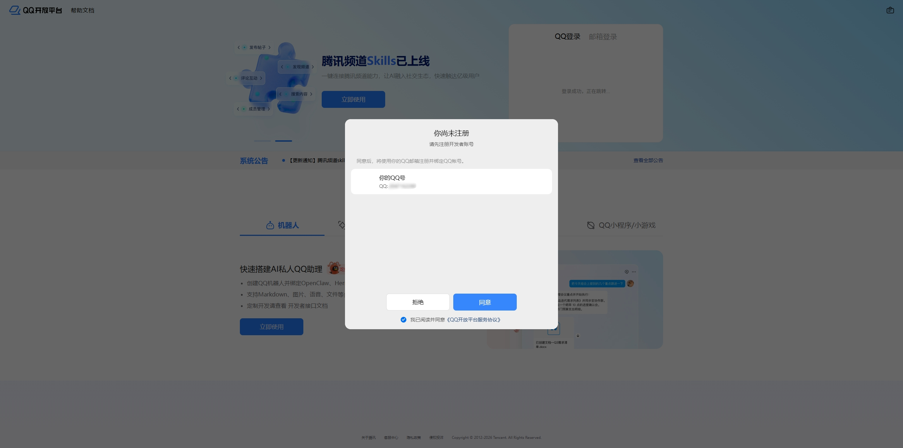

**完成后：** 完成注册，进入开放平台首页。

## 2. 完善主体信息

1. 点击首页顶部的「完善主体信息」，按平台提示填写并提交资料，完成后返回首页。

如果账号已经完成主体信息，可以跳过本步。具体资料以你账号页面的要求为准。

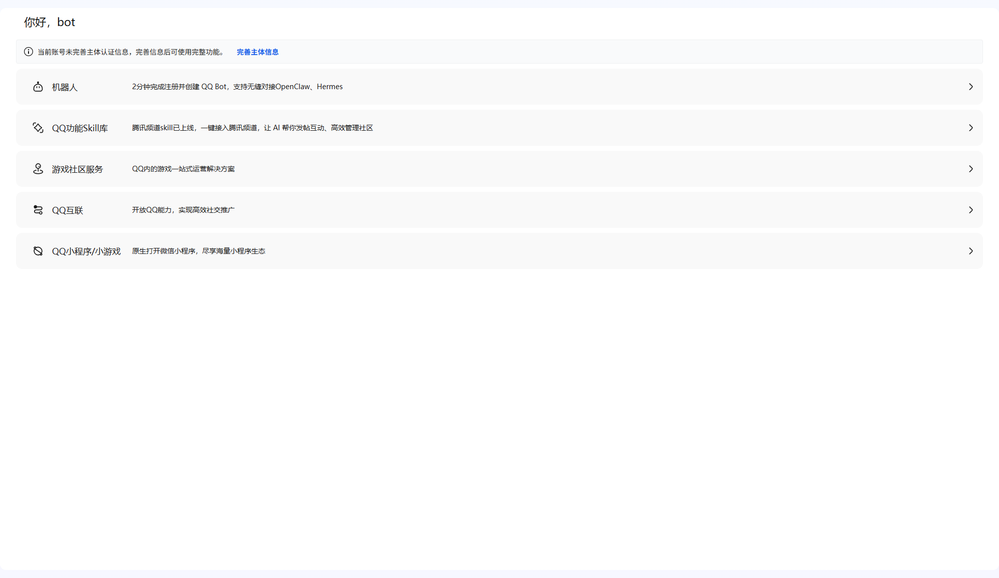

**完成后：** 账号主体信息已按页面要求完善。

## 3. 选择「机器人」

1. 在开放平台首页点击第一项「机器人」。

这里是 QQ 机器人的入口。

**完成后：** 进入「我的机器人」介绍页面。

## 4. 进入机器人管理

1. 点击页面中间的「去创建或管理我的 QQ 机器人」。

这个按钮会进入机器人的创建与管理页面。

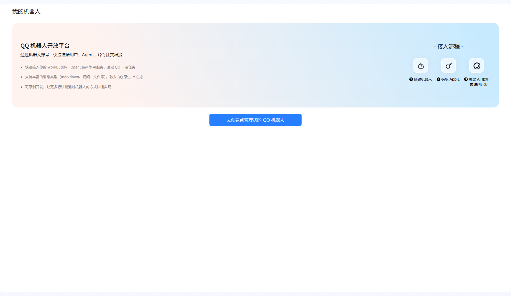

**完成后：** 看到机器人列表或首次创建页面。

## 5. 新建一个机器人

1. 点击「我的机器人」页面右上角的「＋ 创建机器人」。

如果已有要用于通知的机器人，可直接进入它的管理页面，从第 9 步继续。

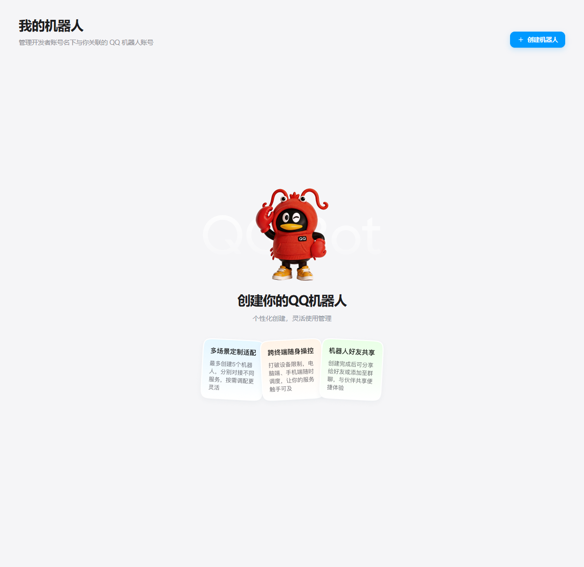

**完成后：** 进入机器人资料填写页面。

## 6. 填写资料并创建

1. 设置机器人的头像、名称和简介。截图以「通知机器人」为例，你可以使用自己的名称。
2. 确认资料后，点击下方的「创建机器人」。

本项目的谢米图标也可以用作机器人头像。

[打开软件头像图片](assets/app-icon.png)

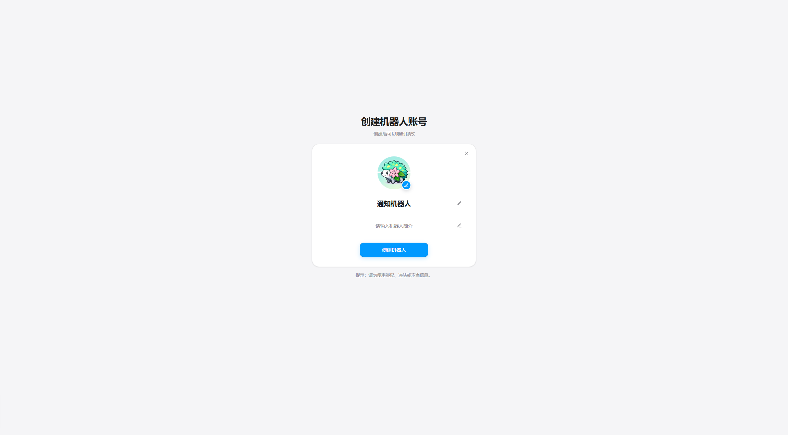

**完成后：** 机器人创建成功，进入「设置 AI 服务」页面。

## 7. 选择「稍后连接」

1. 在「设置 AI 服务」页面，点击右上方的「稍后连接」。

本教程使用 QQ 通知设置连接机器人，这一步可以跳过平台推荐的 AI 服务。

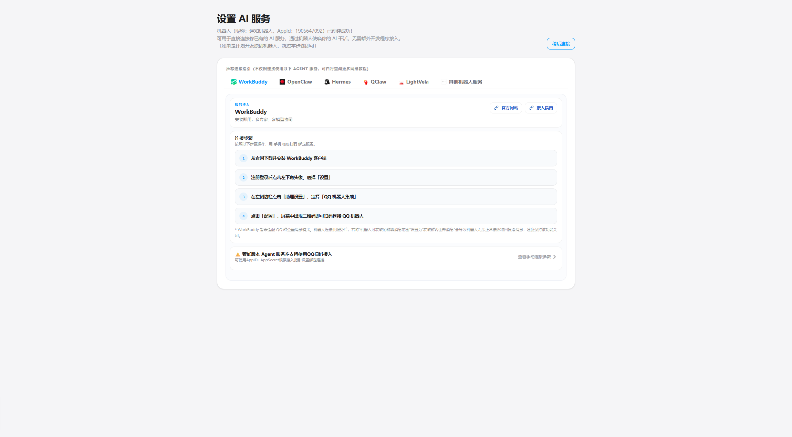

**完成后：** 返回「我的机器人」列表，看到刚创建的机器人。

## 8. 打开机器人的管理页

1. 在机器人卡片上点击右侧箭头，进入它的管理页面。

刚创建时可能显示「离线（服务不可用）」。先继续完成凭据配置，实际收发将在通知设置中验证。

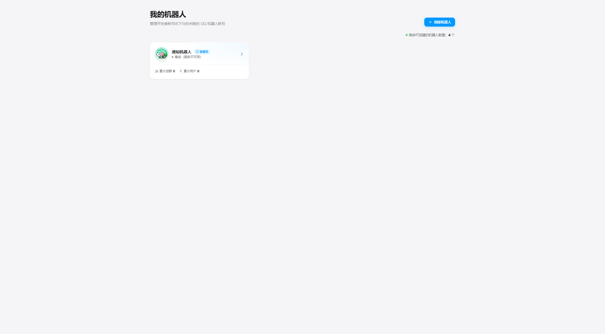

**完成后：** 进入该机器人的账号信息页面。

## 9. 打开「开发设置」

1. 点击左侧菜单最下方的「开发设置」。

接下来需要的 AppID 和 AppSecret 位于这个页面。

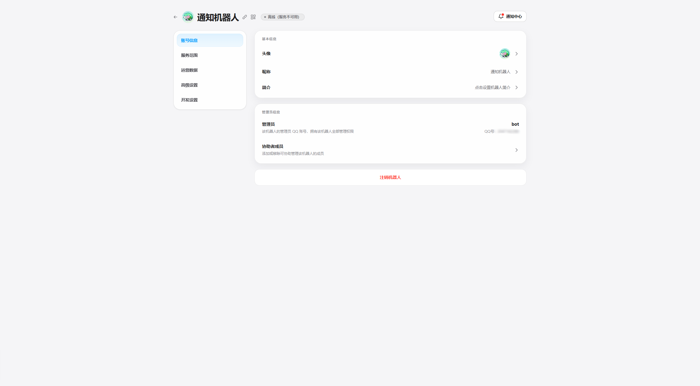

**完成后：** 看到「APPID 接入凭证」和「事件与回调配置」。

## 10. 复制 AppID，获取 AppSecret

1. 点击 AppID 右侧的复制按钮，将它填入 QQ 通知设置的 AppID 输入框。
2. 点击 AppSecret 右侧的眼睛图标；如果弹出重置提示，继续下一步。

确认下方事件接收方式显示「WebSocket」；通知设置用它绑定接收方。已有可用 AppSecret 时，可直接用现有密钥并跳过重置。

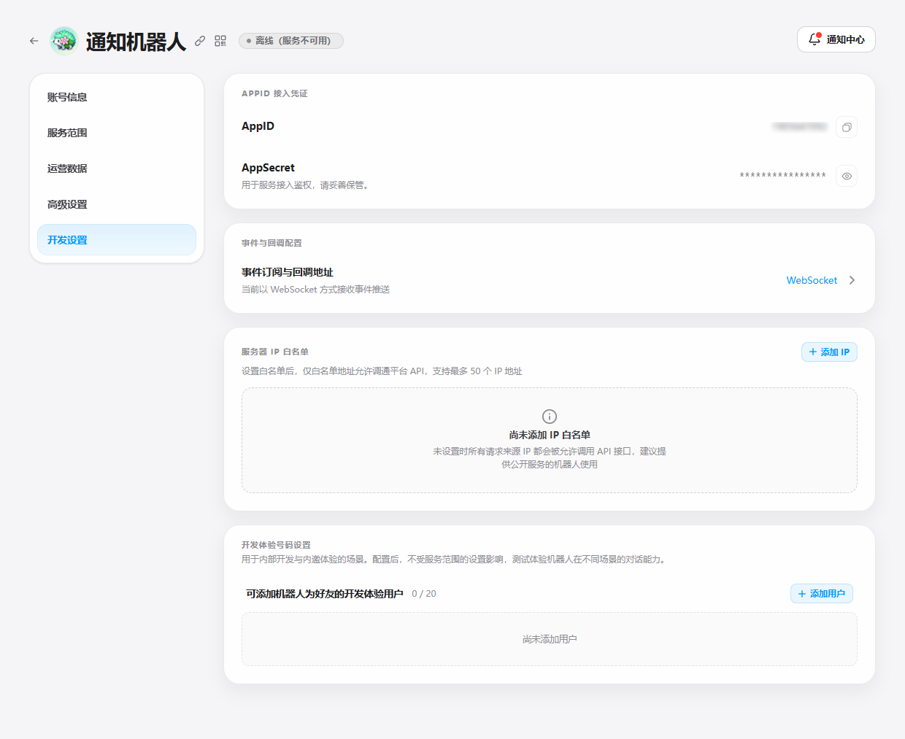

**完成后：** 已取得 AppID，并进入获取 AppSecret 的流程。

## 11. 按需重置 AppSecret

1. 需要生成新密钥时，阅读弹窗说明后点击「确认重置」。已有可用密钥时，点击「取消」并使用原密钥。

> 重置后旧 AppSecret 将失效，已经使用旧密钥的程序也需要更新。无需为了每次测试反复重置。

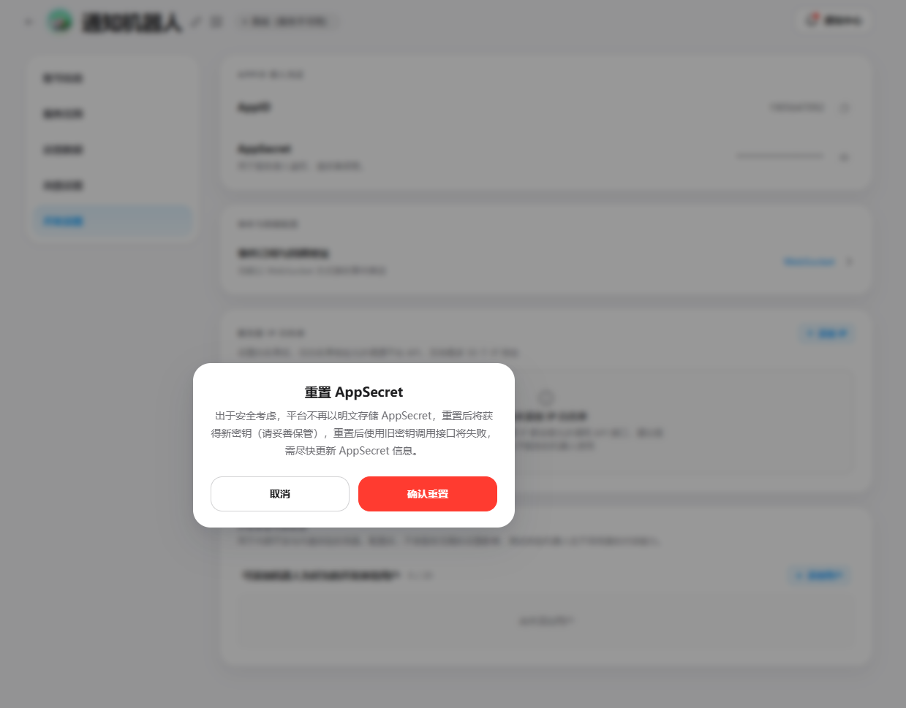

**完成后：** 确认重置后，页面显示新 AppSecret 的复制按钮。

## 12. 复制新密钥，回到通知设置

1. 点击 AppSecret 右侧的复制按钮，将新密钥填入 QQ 通知设置的 AppSecret 输入框。

AppSecret 是机器人鉴权密钥，请自行保存。接收通知的人不需要拿到这份密钥。未勾选「记住密钥」时，软件只在当前会话中使用它。

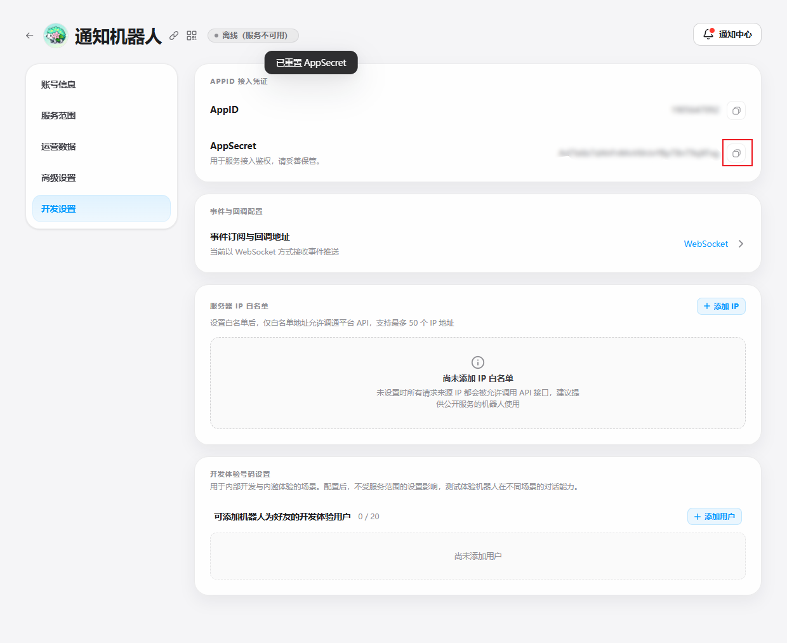

**完成后：** AppID 和 AppSecret 已准备好，可以验证凭据并绑定接收方。

## 验证凭据并绑定接收方

1. 点击主程序顶部的「通知」，进入「接入设置」，或在软件内教程的「连接与绑定」页面继续。
2. 填入 AppID 和 AppSecret，点击「验证凭据」。
3. 私聊：点击「绑定私聊」，等待网关连接成功后显示 6 位绑定码，在 QQ 中向机器人发送当前绑定码。界面逐秒倒计时，每 60 秒自动更换绑定码并重新计时，旧码立即失效。
4. 群聊：先把机器人加入目标群，再点击「绑定群聊」，在目标群内 @机器人并发送当前验证码。
5. 成功后，接收方会自动保存。勾选私聊／群聊，点击「发送图文测试」，默认发送文字和软件 Logo 图片。到 QQ 确认文字、图片都已收到，再点击「我已收到文字和图片」。
6. 打开通知窗口右上角开关，在「通知规则」选择任务完成、任务异常或手动停止等事件。

绑定成功、取消绑定、离开绑定页面或关闭窗口时停止自动换码；网关断开或鉴权失败会明确报错，需要重新连接。可以同时选择私聊和群聊，OpenID 不是 QQ 号或群号。测试图片发送失败时不会算通过。

## 自动通知与凭据保存

默认在整项自动定点乱数／自动 TID 乱数任务完成或异常终止时通知，循环中的常规轮次不逐条推送。手动停止默认不通知，可自行勾选。自动通知默认附带结束时的最新视频画面，没有可用画面时使用软件 Logo。测试通知始终带图片。

发送记录按私聊／群聊分别显示文字和图片的提交结果，网络操作异步执行，不影响任务运行。为避免重复通知，失败后不会自动重发；接口提交成功不等于对方已经看到，请在 QQ 中确认。

配置位于 `%LOCALAPPDATA%\auto_bdsp_rng\settings\qq-notifications.json`。AppSecret 默认只在内存中保留；勾选「记住密钥」后使用 Windows DPAPI 加密保存，仅当前 Windows 用户可解密。未记住密钥时，下次启动需要重新填写才能启用通知。访问令牌不会保存到文件。

需要单独排查 QQ 接口时，仍可运行 `tools/qq_notify_test/run.bat`；独立工具与主程序共用通知客户端，配置各自独立。

## 常见情况

- **无法添加机器人或无法收发：** 检查平台的「服务范围」与「开发体验号码设置」，确认当前用户或群可以使用机器人；发送失败时查看测试工具日志里的 HTTP 状态码与平台错误信息。
- **绑定码已更新：** 发送界面当前显示的新绑定码，旧码不再有效；群聊记得 @机器人。
- **重置后原来的程序鉴权失败：** 更新那些程序中保存的 AppSecret，旧密钥已失效。
- **别人只是接收通知：** 无需向他提供 AppSecret。共用机器人进行客户端发送需要另行设计服务端转发；本教程演示本人用自己的机器人直接连接。
