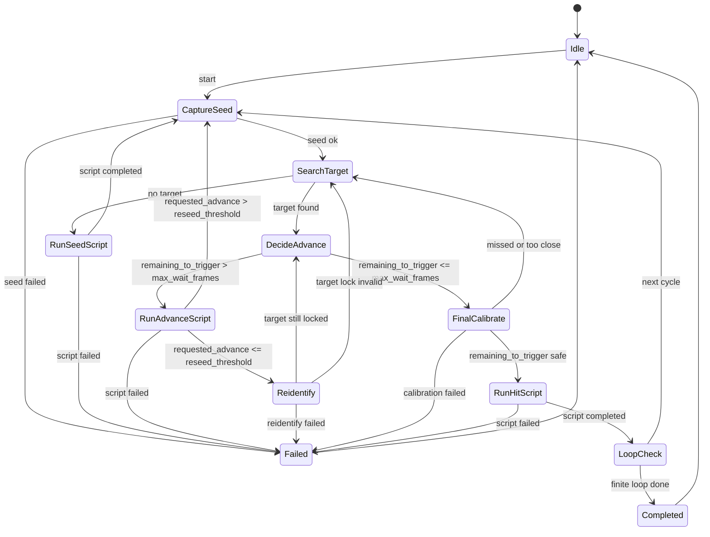

# 自动定点乱数界面设计方案

## 目标

新增一个同级 Tab：`自动定点乱数`，把 Project_Xs 测 seed、BDSP 定点结果搜索、EasyCon 过帧脚本、Project_Xs 重新识别/重新测 seed、撞闪脚本串成一个可观察、可停止、可循环的全自动流程。

本轮只做 UI 与实现思路设计，不写业务代码。

## 核心概念

### 帧数定义

| 名称 | 含义 | 示例 |
|------|------|------|
| `raw_target_advances` | BDSP 定点搜索结果中的目标帧，即 `State8.advances` | 1000 |
| `fixed_delay` | 用户填写的固定 delay，表示固定 `_闪帧` 等待结束后到实际撞到之间的延迟 | 1400 |
| `fixed_flash_frames` | 从撞闪脚本 `_闪帧` 固定数字读取；配置默认 60 只作兜底；自动流程不动态改写脚本 | 60 |
| `trigger_advances` | 撞闪脚本理论启动帧，`raw_target_advances - fixed_delay - fixed_flash_frames` | 340 |
| `current_advances` | 当前已前进帧数，初次测 seed 后为 0，reidentify 后更新 | 600 |
| `remaining_to_trigger` | 距离运行撞闪脚本还剩多少帧，`trigger_advances - current_advances` | 300 |
| `flash_frames` | 撞闪脚本内固定 `_闪帧`，用于让脚本保持稳定的小等待窗口 | 60 |
| `max_wait_frames` | 最大等待帧数；剩余帧数小于等于它时，不再调用过帧脚本 | 300 |
| `reseed_threshold_frames` | 单次过帧超过该值后不用 reidentify，改为重新捕获 seed | 内置 990,000，不在 UI 展示 |
| `min_final_flash_frames` | 最终撞闪前的最小安全剩余帧；太近则放弃本目标 | 内置 5，不在 UI 展示 |

关键规则：
- 搜索目标时，按当前 seed 和筛选条件生成结果。
- 有多个结果时，默认锁定 `advances` 最低的结果。
- 真正决定是否进入撞闪的是 `remaining_to_trigger <= max_wait_frames`。
- 进入撞闪阶段后，必须做最终实时校准；撞闪脚本保持固定 `_闪帧`，自动流程只决定什么时候运行脚本，不再动态改写 `_闪帧`。
- 还没进入等待范围时，给过帧脚本填 `_目标帧数 = remaining_to_trigger`。
- 过帧脚本本身已有内部预留逻辑，例如 `bdsp过帧.txt` 内部会用 `_目标帧数 - 300`，所以自动流程只填理论剩余帧，不额外替脚本扣预留值。

### delay 对 advances 的影响

`fixed_delay` 不参与 seed 搜索，也不修改当前 advances。它表示固定 `_闪帧` 等待结束后到实际撞到之间的用户校准延迟；自动流程会额外扣除固定 `_闪帧` 来决定脚本启动点。

严格公式：

```text
raw_target_advances = state.advances
trigger_advances = raw_target_advances - fixed_delay - fixed_flash_frames
remaining_to_trigger = trigger_advances - current_advances
```

示例：

```text
raw_target_advances = 1800
fixed_delay = 1400
fixed_flash_frames = 60
trigger_advances = 340

current_advances = 0 时，remaining_to_trigger = 340，需要先过帧。
current_advances = 40 时，remaining_to_trigger = 300，可以进入最终撞闪等待区。
```

错误理解要避免：
- 不要把 `fixed_delay` 加到 `current_advances`。
- 不要用 `fixed_delay` 修改 seed 或搜索结果。
- 不要在 `_目标帧数` 里额外扣 delay；过帧阶段逼近的是 `trigger_advances`，不是 `raw_target_advances`。

### `_闪帧` 的固定性

`_闪帧` 不再由自动流程按实时剩余帧动态填写。它是撞闪脚本内固定的小等待窗口，内置脚本默认 60；启动时软件会读取所选撞闪脚本里的固定数字，并用这个值参与 `trigger_advances` 计算。用户通过多次实机运行校准 `fixed_delay`，软件根据实时 advances 决定脚本启动帧。

因此进入 `max_wait_frames` 范围后，自动流程必须执行最终实时校准，但校准目标是“是否已经到达脚本启动点”，而不是重新填写 `_闪帧`：

1. 做一次 final reidentify，或在需要重新测 seed 的场景做 final capture seed。
2. 用最新 seed / current advances 重新搜索或重新确认锁定目标。
3. 从撞闪脚本读取固定 `_闪帧`，得到 `trigger_advances = raw_target_advances - fixed_delay - fixed_flash_frames`。
4. 记录校准参考点：`current_advances_at_ref` 和 `ref_time`。
5. 在即将提交撞闪脚本前，用当前时间修正已经流逝的 advances。
6. 计算 `remaining_to_trigger = trigger_advances - live_current_advances`。
7. `remaining_to_trigger` 安全时，直接按原文运行固定 `_闪帧` 的撞闪脚本。

建议实时修正式：

```text
elapsed_seconds = now_monotonic - ref_time
elapsed_advances = floor(elapsed_seconds / 1.018) * (npc + 1)
live_current_advances = current_advances_at_ref + elapsed_advances
remaining_to_trigger = trigger_advances - live_current_advances
```

第一版安全规则：
- `remaining_to_trigger <= 0`：已错过脚本启动点，不运行撞闪脚本。
- `remaining_to_trigger < min_final_flash_frames`：距离太近，脚本启动和通信误差可能导致错过；放弃本目标并回到测 seed / 搜索流程。
- final reidentify / final capture 到运行撞闪脚本之间的 UI 和文件生成路径要尽量短，不做额外弹窗确认。

## 页面布局

### 顶部操作栏

放在页面最上方，始终可见：
- 运行模式：`单次` / `循环 N 次` / `无限循环`
- 循环次数：仅在 `循环 N 次` 时启用
- 主按钮：`开始自动乱数`
- 次按钮：`暂停`、`停止`
- 状态徽标：`空闲`、`测 seed`、`搜索目标`、`过帧中`、`重新识别`、`撞闪中`、`完成`、`失败`

停止行为先设计为软停止：
- 若当前没有脚本运行，立即停止。
- 若 EasyCon 脚本正在运行，调用 Bridge 的 `stop_current_script()`，等待返回后停止。
- Project_Xs 捕捉中则复用现有 `capture_cancel` 思路。

### 左侧：目标与筛选

这一块复用 BDSP 定点页面的概念，但在自动页独立展示：
- 存档信息：版本、TID、SID、TSV、闪符等。
- 定点目标：分类、宝可梦、等级、模板特性、锁闪信息、固定 IV 数。
- 乱数信息：Seed0/Seed1、初始帧、最大帧数、Offset、队首特性。
- 个体筛选：IV 范围、特性、性别、性格、异色、身高、体重、取消筛选。

推荐实现时抽出 `StaticSearchCriteria` 和 `StaticSearchForm`：
- BDSP 手动页和自动页都从控件生成同一个 criteria。
- 自动页可以提供 `从 BDSP 页同步` 按钮，但不依赖 BDSP 页当前控件状态。

### 中间：自动决策参数

建议用一个紧凑的 `自动策略` 分组：
- 最大帧数范围：默认可沿用用户填写，支持到 1,000,000,000。
- 固定 delay：默认 100，可手动改。
- 最大等待帧数：默认 300，可手动改。
- 重新测 seed 阈值：内置 990,000，不在界面展示；超过就必须重新测 seed。
- 最终撞闪安全下限：内置 5，不在界面展示。
- 无目标处理：默认 `运行测种脚本后重新捕获 seed`。
- 目标选择：默认 `最低帧数`，未来可扩展 `手动选择`。

### 中间：脚本选择

三个下拉框都读取 `D:\codex_project\auto_bdsp_rng\script` 下 `.txt` 和 `.ecs` 文件：
- 测种脚本：默认匹配 `BDSP测种.txt`。
- 过帧脚本：默认匹配 `bdsp过帧.txt`。
- 撞闪脚本：默认让用户选择，常用 `谢米.txt` 或 `玫瑰公园.txt`。

辅助按钮：
- `刷新脚本列表`
- `查看参数`：显示当前脚本可被扫描到的 `_参数名`
- `试填预览`：不运行，只显示将生成的临时脚本文本路径和参数值

参数填充规则：
- 过帧脚本必须包含 `_目标帧数`，否则开始前报错。
- 撞闪脚本必须包含固定数字 `_闪帧`，否则开始前报错；软件以该数字为准计算脚本启动帧。
- 测种脚本可以无参数。

### 右侧：实时运行面板

建议包含四个区域：

1. 当前循环摘要
- 当前循环：`3 / 10` 或 `无限循环第 3 次`
- 当前 seed：S0-S3 与 Seed0/Seed1
- 锁定目标：宝可梦、raw target、trigger advances、delay
- 当前 advances：reidentify 后更新
- 剩余到撞闪：`remaining_to_trigger`

2. 决策时间线
- `测 seed`
- `搜索目标`
- `运行测种脚本`
- `运行过帧脚本`
- `重新识别 / 重新测 seed`
- `运行撞闪脚本`

每个节点显示：等待中、运行中、成功、失败、跳过。

3. 候选结果表
- 复用 BDSP 结果列。
- 默认高亮最低帧结果。
- 若已锁定目标，单独标记“当前锁定”。

4. 日志
- 每一步写明输入和决策结果，例如：
  - `捕获 Seed 成功：Seed0=..., Seed1=...`
  - `在 10,000,000 帧内找到 4 个目标，锁定最低帧 1,000`
  - `trigger=900, current=0, remaining=900 > max_wait=300，运行过帧脚本`
  - `本轮过帧请求 900，超过阈值？否，下一步 reidentify`
  - `reidentify 得到 current=600，remaining=300，进入最终校准`
  - `final reidentify current=335，实时修正后 remaining_to_trigger=5，运行固定 _闪帧 脚本`

## 状态机设计



## 目标锁定策略

推荐第一版采用“锁定目标 + 必要时重搜”的折中策略：

- 初次测 seed 后搜索目标，选最低帧并锁定。
- 过帧量不超过 99 万时，使用 reidentify；reidentify 返回的 advances 可继续用于同一个锁定目标，计算 `remaining_to_trigger`。
- 过帧量超过 99 万时，重新捕获 seed；这时旧目标与当前 seed 的相对关系不再可靠，重新搜索目标并锁定新的最低帧。
- 如果 reidentify 后发现 `remaining_to_trigger <= 0`，说明已经错过触发点，本轮标记为 `target_missed`，回到 `SearchTarget` 或进入下一循环。
- 如果已经进入 `max_wait_frames`，先进入 `FinalCalibrate`，确认脚本启动点仍未错过，再运行固定 `_闪帧` 的撞闪脚本。

这个策略既符合“过帧后知道当前第几帧继续逼近目标”的需求，又允许长距离过帧后重新校准。

## 服务层设计

建议新增一个自动流程服务，而不是让自动页直接调用按钮：

```text
auto_bdsp_rng/
  automation/
    auto_rng/
      models.py        # AutoRngConfig, AutoRngState, AutoRngDecision
      runner.py        # 状态机与循环控制
      scripts.py       # 脚本选择、参数校验、试填
      search.py        # criteria -> StaticGenerator8 -> candidates
  ui/
    auto_rng_panel.py  # 新 Tab
```

服务层职责：
- 从 UI 配置生成 `AutoRngConfig`。
- 调用 Project_Xs 捕获 seed / reidentify。
- 调用 StaticGenerator8 搜索候选。
- 调用 EasyCon Bridge 运行脚本文本。
- 发出状态、日志、候选列表、错误事件给 UI。

UI 职责：
- 展示配置与状态。
- 接收用户开始/暂停/停止。
- 不直接做长耗时逻辑。

线程模型：
- 自动 runner 放入 `QThread` 或独立 worker。
- Project_Xs 捕获与 EasyCon Bridge 脚本运行都由 runner 串行等待。
- UI 只通过 Qt Signal 更新。

## 异常与安全规则

- 开始前校验 EasyCon Bridge 已连接。
- 开始前校验三个脚本文件存在且编码为 UTF-8。
- 开始前校验过帧脚本包含 `_目标帧数`。
- 开始前校验撞闪脚本包含 `_闪帧`。
- `raw_target_advances <= fixed_delay + fixed_flash_frames` 时不允许启动撞闪，提示 delay 或固定 `_闪帧` 过大。
- `remaining_to_trigger <= 0` 时判定已错过目标，不运行撞闪。
- 最终校准后的 `remaining_to_trigger <= 0` 时判定已错过脚本启动点，不运行撞闪。
- 最终校准后的 `remaining_to_trigger < min_final_flash_frames` 时判定距离太近，放弃本目标。
- `max_wait_frames` 建议最小 1，避免填入 0 导致脚本边界不清。
- 每次脚本完成后必须记录 exit code、stdout、stderr。
- 自动流程失败时保留日志和最后一次生成的临时脚本路径。

## 第一版验收标准

- 新 Tab 能展示完整自动配置。
- 三个脚本下拉框能读取 `script` 目录。
- 自动页能用与 BDSP 页面一致的筛选条件得到候选结果。
- 无目标时能运行测种脚本并回到测 seed。
- 有目标时能按最低帧锁定目标。
- 能按 `fixed_delay` 计算 `trigger_advances`。
- 能按 `max_wait_frames` 决定过帧还是撞闪。
- 过帧脚本运行前能填 `_目标帧数`。
- 撞闪脚本运行前能做最终实时校准，并保持脚本内固定 `_闪帧` 不被自动流程改写。
- 过帧脚本完成后能按内置 99 万阈值选择 reidentify 或重新捕获 seed。
- 支持单次、循环 N 次、无限循环。
- 支持停止当前流程。
